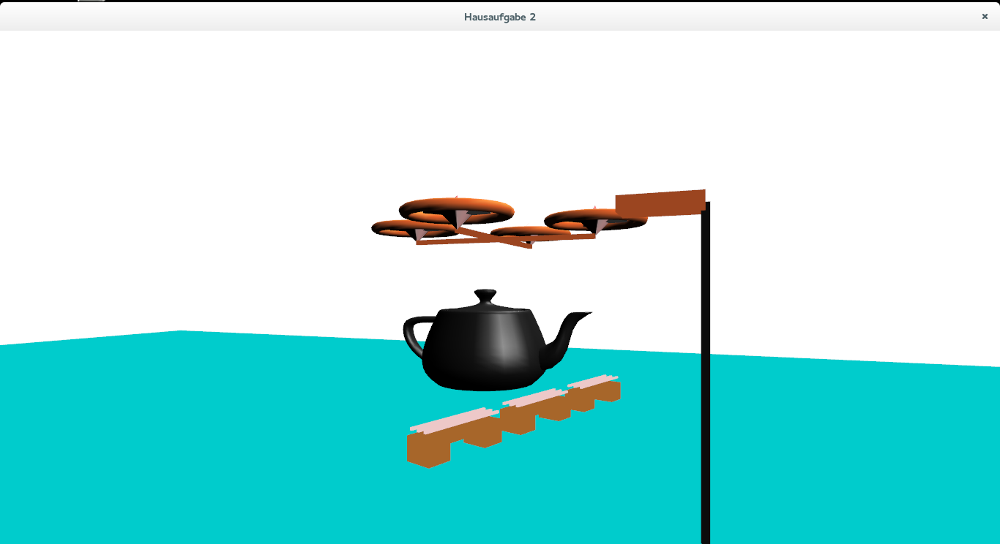

##### Hinweis
Das Projekt wurde auf dem Betriebssystem Fedora 20 realisiert. Es musste
nur die Bibliothek freeglut (`yum install freeglut-devel`) installiert werden.
Der Befehl `make` kompiliert das Programm und mit `./bin/drone` kann es
ausgeführt werden.
Das Programm kann mittels `Escape-Taste` geschlossen werden.
Die Materialeigenschaften wurden aus der Tabelle 
[OpenGL-Materials](http://devernay.free.fr/cours/opengl/materials.html)
entnommen. Die Werte in den Klammern beschreiben die Quellcode-Zeilen in
der die Aufgabe gelöst wurde.

#### Aufgabe 1: 3 Bänke setzen (434-451) 
Es wurden 3 Bänke mit `set_bank()` in die Szene eingefügt. Gedreht werden
die Bänke mit `glRotated(432 % 360, 0.0, 1.0, 0.0);` wobei sich der Drehwinkel
aus dem ITMZ-Account ergibt. Die Ziffen sind absteigend sortiert.

#### Aufgabe 2: quaderförmige Lampe (453-464)
Die Lampe setzt sich aus 2 Stücken zusammen. Sie wird am Ende der 
`display()`-Funktion definiert. Der Lampenfuß wird schwarz gefärbt, der
Lampenkopf in einem Kupferton.

#### Aufgabe 3: Uquader (84-176)
Der U-Quader wird in der Funktion `uquader()` beschrieben. Für die Modellierung
wurden ausschließlich `GL_QUAD_STRIP`s verwendet. Die Maßen für den Quader
werden über die Funktionsparametern gesetzt.

#### Aufgabe 4: Objekt Drohne (227-308)
Die Drohne wird in der Funktion `set_drone()` beschrieben. Die Drohne besteht
aus 2 gekreuzten Quadern und 4 Rotoren. Die Rotoren werden in der Funktion
`set_rotor()` beschrieben. Hier folgt auch die Animation für die Rotor-Blätter.
Animiert wird über die folgenden Funktionen: 
 
```
glutGet(GLUT_ELAPSED_TIME)/1000.0f *15; 
glRotated(angle*10*speed, 0.0, 1.0, 0.0);
```
Die Dreh-Geschwindigkeit kann über die `LEERTASTE` beeinflusst werden.

#### Aufgabe 5: Steuerung der Drohne (351-387, 468)
Die Drohne kann über die Tasten `a-w-s-d` gesteuert werden. Wobei die
`a-d` Tasten die Drohne nach Links bzw. nach Rechts bewegt. Mit den Tasten
`w-s` kann die Drohne hoch-runter bewegt werden. Mit der `LEERTASTE` 
kann die Geschwindigkeit für das Auf- und Ab-Bewegen beeinflusst werden.
Die Rotorblätter drehen sich nun schneller, und die Drohne kann schneller 
bewegt werden. 
 
#### Aufgabe 6: phongsches Beleuchtungsmodell (409, 431)
Es wurde im sichtbaren Bereich eine Teekanne plaziert,
um die Beleuchtung zu zeigen (`glutSolidTeapot()`). 
Die Sonne wird mit dem Befehl `GLfloat light_position1[]= { 0.0f, 20.0f, -20.0f, 1.0f}`
plaziert.

#### Aufgabe 7: Kameraabbildungen (396, 479-500)
Die Kamera kann mithilfe der Pfeiltasten beeinflusst werden.
Siehe Quelltext Zeile *396*.

## Screenshot


